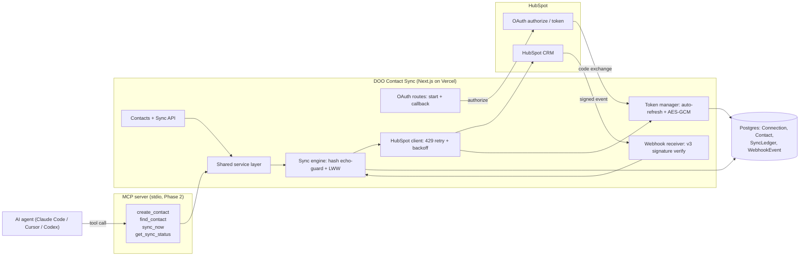

# DOO Contact Sync

A production-grade two-way contact sync connector between **HubSpot** and a local
"DOO-side" contact store. Built for the DOO Builders League, Track C (CRM
Connectors).

- **OAuth 2.0** authorization-code flow with automatic access-token refresh.
- **Signature-verified webhooks** (HubSpot v3) - the body is never trusted
  without a valid signature.
- **Two-way contact sync** with a Postgres-backed **sync ledger**: idempotent,
  loop-protected, with last-write-wins conflict resolution.
- **Resilient** HubSpot calls: 429 handling + exponential backoff, structured
  logging with secret redaction, and a health endpoint.

Stack: Next.js (App Router) + TypeScript (strict) + Prisma + Supabase Postgres,
deployed on Vercel.

This repository also includes an **MCP server** (Phase 2) that exposes the same
actions as tools an AI agent can call. The HubSpot half of the integration runs
live against a real HubSpot portal; the honest scope note below says exactly
what is real and what is a local stand-in.

---

## What is real vs. a local stand-in

Being precise about scope, because production credibility depends on it.

**Real, end to end:**
- A registered HubSpot OAuth app and the real authorization-code flow with
  automatic access-token refresh.
- Real CRM reads and writes through the HubSpot API, and real HubSpot v3
  webhook-signature verification on the raw request body.
- OAuth has been exercised live against a real HubSpot portal - the callback
  stored real access and refresh tokens in Postgres.
- Postgres (Supabase) is the real source of truth: `Connection`, `Contact`,
  `SyncLedger`, and `WebhookEvent`, applied with real migrations.
- The MCP server is real and runs over stdio with four working tools.

**Local stand-in (by necessity):**
- The "DOO side" of the sync is represented by this project's own Postgres
  contact store, because DOO's internal contact API is not publicly available.
  The sync engine talks to a small `ContactRepo` port, so replacing the local
  store with DOO's real API is a single adapter - the idempotency, loop guard,
  and conflict resolution are unchanged.

Nothing here is faked to look like it works: the HubSpot half is genuinely live;
only DOO's unavailable internal endpoint is represented by a real local database
behind a clean interface.

---

## How it works

### OAuth 2.0
1. `GET /api/oauth/start` generates a random `state`, stores it in an httpOnly
   cookie, and redirects to HubSpot's authorize URL
   (`https://app.hubspot.com/oauth/authorize`).
2. HubSpot redirects back to `GET /api/oauth/callback`. We verify `state`
   (CSRF), exchange the `code` for tokens at
   `POST https://api.hubapi.com/oauth/v1/token`, look up the portal id from the
   token, and store the tokens.
3. The **token manager** (`lib/hubspot/tokens.ts`) returns a valid access token
   on demand, transparently refreshing it ~60s before expiry (HubSpot access
   tokens last 30 minutes). Tokens are encrypted at rest with AES-256-GCM when
   `TOKEN_ENCRYPTION_KEY` is set, and are never logged.

### Webhooks (inbound)
`POST /api/webhooks/hubspot` reads the **raw** body, then verifies the
`X-HubSpot-Signature-v3` header:

```
expected = base64( HMAC_SHA256( key = client_secret,
                                data = METHOD + URI + body + timestamp ) )
```

The `X-HubSpot-Request-Timestamp` (ms) must be within 5 minutes; comparison is
constant-time. Invalid signatures are rejected with `401` before any parsing.
Valid events are deduplicated by HubSpot `eventId`, then upserted locally.

### Two-way sync
- **Outbound** (`local -> HubSpot`): create/update a local contact pushes to
  HubSpot (PATCH when `hubspotObjectId` is known, otherwise create).
- **Inbound** (`HubSpot -> local`): a webhook fetches the authoritative contact
  from HubSpot and upserts locally.
- **Loop prevention**: every successful sync records `lastSyncedHash` (a SHA-256
  of the normalized field set). Before applying a change in either direction, an
  incoming hash equal to `lastSyncedHash` is recognized as an echo of our own
  write and skipped.
- **Conflict resolution**: last-write-wins by update timestamp (local
  `updatedAt` vs HubSpot `lastmodifieddate`). Documented and unit-tested.
- **`POST /api/sync`** reconciles both sides on demand.

---

## Architecture



Outbound: a local change -> Sync Engine -> HubSpot Client -> HubSpot. Inbound: a
signed webhook -> verify -> Sync Engine fetches the authoritative record ->
upsert local. The `lastSyncedHash` echo guard stops the two directions from
looping; the ledger records every attempt.

## Endpoints

| Method | Path | Purpose |
| ------ | ---- | ------- |
| GET | `/api/health` | service, config, database, token status |
| GET | `/api/oauth/start` | begin OAuth (redirect) |
| GET | `/api/oauth/callback` | OAuth redirect target |
| POST | `/api/webhooks/hubspot` | inbound events (signature-verified) |
| GET | `/api/contacts` | list local contacts |
| POST | `/api/contacts` | create local contact + push outbound |
| GET | `/api/contacts/:id` | fetch one local contact |
| PATCH | `/api/contacts/:id` | update local contact + push outbound |
| POST | `/api/sync` | reconcile both sides |

See `docs/openapi.yaml` for the full contract.

---

## MCP server (Phase 2)

`mcp/` is a stdio MCP server that exposes the connector's actions as four tools
an AI agent (Claude Code, Cursor, Codex) can call directly:

| Tool | Purpose |
| ---- | ------- |
| `create_contact` | create a local contact and push it outbound to HubSpot |
| `find_contact` | look a contact up by email (local store, then HubSpot) |
| `sync_now` | reconcile both sides on demand |
| `get_sync_status` | connection state + recent sync-ledger summary |

It reuses the **same shared service layer** as the HTTP API, so there is no
duplicated business logic. Every tool validates its input with zod and always
returns a structured result (it never throws), so an agent never hangs. See
`mcp/README.md` to register and run it.

---

## Project layout

```
app/api/...            Route handlers (oauth, webhooks, contacts, sync, health)
lib/env.ts             Validated environment access (zod)
lib/logger.ts          Structured logging with secret redaction
lib/prisma.ts          PrismaClient singleton
lib/crypto/            AES-256-GCM token cipher (tokens at rest)
lib/hubspot/           oauth, tokens, client (retry/backoff), signature, contacts
lib/sync/              ports, engine (outbound/inbound), reconcile, hash, mapping, adapters
lib/validation.ts      zod input schemas
prisma/schema.prisma   Connection, Contact, SyncLedger, WebhookEvent
mcp/                   stdio MCP server (4 tools) + its own README
test/                  vitest unit + round-trip tests
docs/openapi.yaml      API contract
```

The sync engine depends on **ports** (interfaces), wired to Prisma + the HubSpot
client in production and to in-memory fakes in tests - so the core logic is
fully unit-testable without a live portal or database.

---

## Environment variables

Copy `.env.local.example` to `.env.local` and fill in real values (never
commit `.env.local`).

| Variable | Required | Notes |
| -------- | -------- | ----- |
| `HUBSPOT_CLIENT_ID` | yes | OAuth app client id |
| `HUBSPOT_CLIENT_SECRET` | yes | OAuth app client secret (also the webhook signing key) |
| `HUBSPOT_REDIRECT_URI` | yes | `http://localhost:3000/api/oauth/callback` in dev |
| `HUBSPOT_SCOPES` | no | defaults to `oauth crm.objects.contacts.read crm.objects.contacts.write` |
| `APP_BASE_URL` | no | public base URL; must match the URL HubSpot calls for webhooks |
| `TOKEN_ENCRYPTION_KEY` | no | base64 32-byte key to encrypt tokens at rest |
| `DATABASE_URL` | yes | Supabase **pooler** connection (runtime) |
| `DIRECT_URL` | yes | direct/session-pooler connection (migrations) |

---

## Running locally

```bash
npm install
npm run prisma:generate          # generate the Prisma client
npm run db:check                 # verify the database connection
npm run dev                      # start Next.js on http://localhost:3000
```

Then connect a portal: open `http://localhost:3000/api/oauth/start` in a
browser and approve the scopes.

### Database migrations (Supabase note)
`DATABASE_URL` (pooler) is used at runtime. `prisma migrate` uses `DIRECT_URL`.
On Supabase, the legacy direct host is IPv6-only; if migrations report `P1001`,
point `DIRECT_URL` at the **Session pooler** connection string (port 5432) from
the Supabase dashboard (Project Settings -> Database -> Connection string ->
Session pooler). The initial schema in `prisma/migrations/0_init` has already
been applied to the configured database.

For serverless/transaction-pooler runtime (port 6543), append
`?pgbouncer=true&connection_limit=1` to `DATABASE_URL`.

---

## Deploy (Vercel)

The app deploys to Vercel with no special configuration - the framework is
auto-detected and the build runs `prisma generate && next build` (the Prisma
client is generated on Vercel's Linux builders, so the correct query engine is
bundled - no `binaryTargets` needed). The Node.js runtime is pinned to 22.x via
`engines` in `package.json`; `vercel.json` pins the framework and build command.

1. Set the environment variables listed in `DEPLOY-ENV-VARS.txt` in the Vercel
   project (Production scope), taking the values from your local `.env.local`.
2. For the live domain, set `APP_BASE_URL` to the Vercel URL and
   `HUBSPOT_REDIRECT_URI` to that URL + `/api/oauth/callback` (not localhost).
3. In the HubSpot app, add the production redirect URL
   (`<live-url>/api/oauth/callback`) and the webhook target URL
   (`<live-url>/api/webhooks/hubspot`), and subscribe to contact creation and
   property-change events.

`GET <live-url>/api/health` returns `200` with `database: true` and
`config: true` once the variables are set.

---

## Verification

```bash
npm run typecheck   # tsc --noEmit (strict)
npm test            # vitest: signature, tokens, conflict/idempotency, round-trip
npm run build       # prisma generate + next build
```

---

## Security notes

- Webhook bodies are rejected unless the v3 signature is valid and fresh.
- Tokens are encrypted at rest (when a key is configured) and never logged;
  the logger redacts secret-like keys and inline bearer tokens.
- All external input is validated with zod.
- OAuth uses a CSRF `state` parameter bound to an httpOnly cookie.
